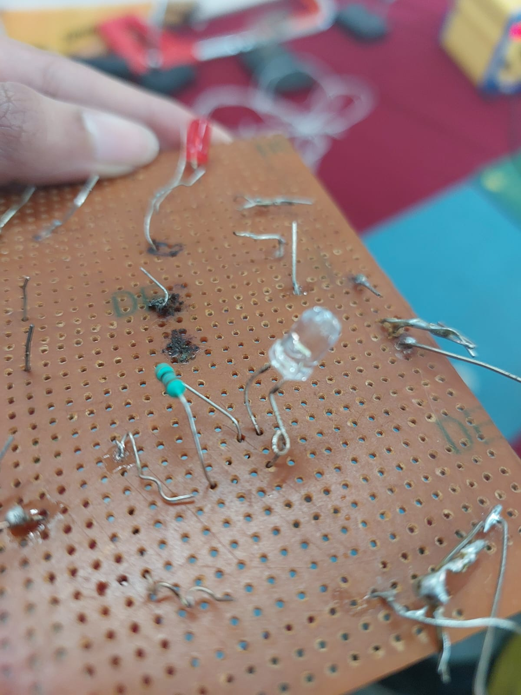
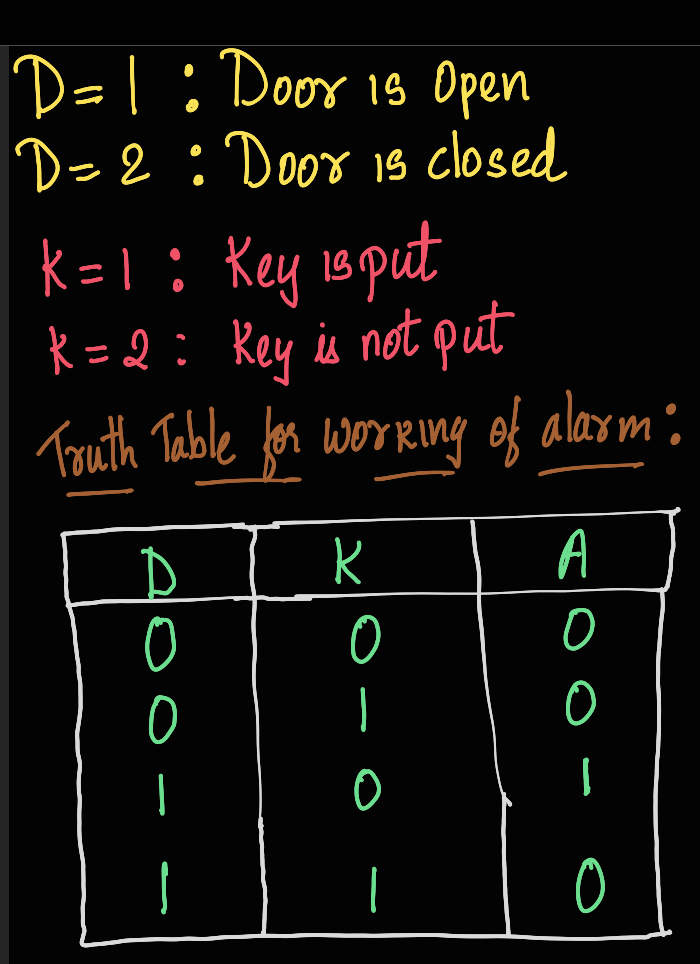

# LEVEL-0 GENERIC TASKS

## TASK 1: 3D PRINTING
Through this task, I learned the fundamentals of 3D printing, including how the printer operates and the purpose of STL files in defining 3D object geometry. I understood how to use **Creality Slicer** to convert STL files into G-code for printing. Additionally, I explored critical printer settings such as **bed temperature, infill density, nozzle temperature**, and their impact on the print's quality, especially when using PLA material. By studying the SOPs, I learned how to safely and efficiently operate the 3D printer. Finally, by slicing and printing an STL file, I gained hands-on experience with the entire 3D printing workflow, from preparation to printing.  
.png)
.png)

---

## TASK 2: API
In this task, I learned about what an API (Application Programming Interface) is and how it enables communication between different software applications. In the app, I used **JavaScript, HTML, and CSS**, but only basic CSS.  
.pnghttps://github.com/NiranjanaReddy/Niranjana-D-P-001/blob/main/Screenshot%20(40).png)    
**[GITHUB LINK](https://github.com/NiranjanaReddy/WeatherAPI)**

---

## TASK 3: WORKING WITH GITHUB
In this task, I started by forking the given repository to my GitHub account and cloning it to my computer. Then, I created a new branch called "NiranjanaReddy" to fix an error in the code. The error was caused by a `+1` in the `main.py` file, so I corrected it. After making the changes, I staged and committed them, then pushed the branch to my forked repository. Finally, I created a pull request to merge my changes into the main branch.  
  
[GitHub Link](https://github.com/NiranjanaReddy/git-task)  

---

## TASK 4: UBUNTU COMMAND LINE
I learned how the Ubuntu command line works. I created a test folder, opened it, and then created **2600 folders** as mentioned in the task.  
  

---

## TASK 5: KAGGLE CONTEST
I used the Random Forest Classifier model and predicted the outcome of survival of the remaining passengers aboard the Titanic in the test CSV file and logged the data in a new CSV file.  

---

## TASK 6: WORKING WITH PANDAS AND MATPLOTLIB
I created a dataset of **Sales and Profit** for the first 6 months of the year and plotted the **line, bar, and scatter plots**. I used **Google Colab** to plot these graphs.  
  
  
  
**[GITHUB LINK](https://github.com/NiranjanaReddy/Pandas_Matplotlib)**

---

## TASK 7: PORTFOLIO WEBSITE
Using **HTML, CSS, and JavaScript**, I designed my portfolio website.  
  
  
**[GITHUB LINK](https://github.com/NiranjanaReddy/My-Portfolio)**

---

## TASK 8: RESOURCE ARTICLE USING MARKDOWN
I wrote an article about **Salt Batteries** and how they are a better alternative to regular Lithium-ion batteries.  
[Article](https://github.com/NiranjanaReddy/Article/blob/main/article.md)

---

## TASK 9: TINKERCAD
I started by exploring the **Tinkercad** application, learning how to set up circuits, connect components, and add or edit them as needed. After getting familiar with the basics, I created a new circuit in Tinkercad and simulated the assigned task.  
**[SIMULATION LINK](https://www.tinkercad.com/things/4vyfyIDaNJv-ultrasonic-radar-with-led)**  

---

## TASK 10: SPEED CONTROL OF DC MOTOR
This task helped me understand the basics of controlling DC motors and using an **L298N motor driver** with an Arduino. I learned how to connect and program the components to control the speed and direction of a **5V DC motor** using **PWM**, a **potentiometer**, and an **H-Bridge circuit**.   
  

[VIDEO](Speed%20of%20DC%20motor%20video.mp4)

---

## TASK 11: LED TOGGLE USING ESP32
I learned how to work with the **ESP32 microcontroller** and its capabilities. I also learned about configuring the Arduino IDE to program the ESP32, which involved installing the necessary board libraries and drivers. I made the connection, copied the code, and uploaded it to the ESP32. I entered the mobile hotspot credentials into the code and changed the baud rate to `115200`. During compilation, an **IP Address** was generated, which, when pasted into a browser, allowed me to toggle the LED using the website.  
  
  
[VIDEO](LED%20toggle%20video.mp4)

---

## TASK 12: SOLDERING PREREQUISITES
I learned how the soldering iron works and other accessories like the sponge, as well as the process of soldering. I then soldered an **LED and resistor** in series and used a **9V battery** to light up the LED.  
  

---

## TASK 13: 555 IC ASTABLE MULTIVIBRATOR WITH 60% DUTY CYCLE
I understood the working of the **555 timer IC**. The task was to design a **555 astable multivibrator** with a **60% duty cycle**. First, I calculated the ratio of resistors required for designing the astable multivibrator. After **3 failed attempts**, on the **fourth attempt**, I achieved a duty cycle of **60.49%**.  
  

---

## TASK 14: KARNAUGH MAPS AND DERIVING THE LOGIC CIRCUIT
In this task, I had to design a burglar alarm. First, I started by finding the results of the truth table. The buzzer is activated when the door is opened in the absence of the key. The burglar alarm is denoted by **‘A’**, where `1` means the alarm is activated and `0` means the alarm is off.  
The alarm works on the basis of the given truth table:  
  
  
[LOGIC GATE VIDEO](k-map%20logic%20gate%20circuit.mp4)

---
## TASK 15: Active Participation
I successfully completed a course on Siemens NX CAD, gaining foundational knowledge and practical skills in computer-aided design (CAD) using this industry-leading software. During the course, I learned how to navigate the Siemens NX interface, create 2D sketches, and develop 3D models efficiently.

## TASK 16: DATASHEETS REPORT WRITING
The **L293D** is a dual-channel H-bridge motor driver IC, capable of controlling two DC motors independently or one stepper motor. Each channel operates as a full H-bridge, allowing motors to run forward, backward, or stop. It supports a variety of loads such as 4 uni-directional DC motors, 2 bi-directional DC motors, 1 stepper motor, solenoids, or inductive loads.  
  

To protect the IC and the circuit from voltage spikes generated when the motor is de-energized, the **L293D** includes internal kick-back diodes. It operates with motor supply voltages between **4.5V and 36V**, making it compatible with most DC motors. It provides up to **1.2A peak current per channel** and **600mA continuous current**, sufficient for driving small and medium-sized motors.  
  

**Pulse Width Modulation (PWM)** is a highly efficient method used to control the speed of DC motors by varying the average voltage delivered to the motor. Instead of supplying a constant voltage, PWM rapidly switches the power on and off, creating pulses. The ratio of the "on" time to the total cycle time, known as the duty cycle, determines the effective voltage. A higher duty cycle results in a faster motor speed, while a lower duty cycle slows it down. The frequency of the PWM signal ensures smooth operation without noticeable jerks.  
  

An **H-Bridge** is an electronic circuit used to control the direction of rotation of a DC motor. It consists of four switches, typically transistors or MOSFETs, arranged in an "H" configuration. By selectively closing these switches, the current can flow through the motor in either direction, enabling forward or reverse rotation. For example, activating one diagonal pair of switches drives the motor forward, while activating the opposite diagonal pair reverses its direction. Turning off all switches stops the motor, and activating both switches on the same side can apply a braking effect.

---

## TASK 17: INTRODUCTION TO VR
### Virtual Reality (VR) and Augmented Reality (AR)

#### Virtual Reality (VR)
Virtual Reality is the simulation experience that lets people interact with a computer-generated environment. This experience occurs through immersive hardware in which head-mounted displays (HMDs), gloves, or motion trackers are used. With VR, the surroundings are completely replaced by a virtual world to create an enhanced sensory-rich experience commonly utilized for gaming, training, healthcare, and entertainment purposes.

**Important Characteristics of VR:**
- It allows users to be fully transported to a virtual environment.
- It makes interactive operation with the virtual environment through motion-tracking devices.
- It completely uses the computer-generated environment and does not have real-world content.

#### Augmented Reality (AR)
Augmented Reality (AR) overlays digital information and virtual objects onto the real world. Unlike VR, AR enhances the physical world by superimposing computer-generated visuals, sounds, or other sensory data through devices such as smartphones, AR glasses, or tablets.

**Important Characteristics of AR:**
- Integrates real-world and digital elements.
- Enhances the existing environment rather than replacing it.
- It is widely used in retail, education, healthcare, navigation, and industrial training.

#### Difference Between VR and AR
| Feature           | Virtual Reality (VR)                     | Augmented Reality (AR)                   |
|-------------------|------------------------------------------|------------------------------------------|
| Environment       | Fully synthetic, replaces the real world | Real-world environment enhanced digitally |
| Immersion         | High – Users are fully immersed          | Partial – Users remain in their real environment |
| Hardware          | Requires HMDs, gloves, motion trackers   | Requires smartphones, AR glasses, or tablets |
| Applications      | Gaming, training simulations, therapy    | Retail, real estate, healthcare, education |
| Interaction       | Fully interactive in virtual space       | Interaction with virtual objects in real-world locations |

#### Current Trends for VR and AR
1. **MR Evolution - Mixed Reality**: AR or VR combined to provide more hybrid environments with perfect interactions between physical and virtual interfaces.
2. **Hardware Advancements**: Products like Meta Quest, Apple Vision Pro, and HoloLens advance the boundaries of resolutions, lighter designs, and natural interactions.
3. **Integration of AI**: This enables experiences to be made interactive and adaptive.
4. **Healthcare Applications**: Examples of VR for pain management and AR for surgical navigation.
5. **Education and Training**: Both VR and AR are now an essential tool for immersive learning and professional training.
6. **5G and Cloud Computing**: High-speed connectivity and cloud infrastructure enhance the performance of AR/VR applications.
7. **Social VR**: Platforms such as VRChat and Meta's Horizon Worlds are creating social interaction in virtual environments.

#### Technology Stack used in AR/VR
1. **Hardware:**
   - AR: HoloLens AR glasses and Magic Leap One AR, Smartphones and Tablets
   - VR: HMDs (Meta Quest, HTC Vive, PlayStation VR), motion trackers, haptic feedback devices.
2. **Software:**
   - Development tools: Unity, Unreal Engine.
   - SDKs: ARKit (Apple), ARCore (Google), Vuforia.
   - Middleware: Libraries and APIs for improving performance.
3. **Connectivity:**
   - High-speed internet and 5G networks.
   - Cloud services for scalable and real-time data processing.
4. **AI and ML:**
   - Increased interactivity and realism.
   - Natural language processing for better user interfaces.
5. **Sensors and Cameras:**
   - Depth sensors, LiDAR, and stereo cameras for spatial mapping.

#### Indian Companies in the AR/VR Space
1. **Tesseract (Reliance Industries):** Specialized in AR/VR hardware and software offering immersive solutions across various sectors.
2. **Scapic:** A cloud-based platform for building AR/VR experiences acquired by Flipkart to enhance e-commerce.
3. **SmartVizX:** Concentrates on virtual reality solutions for architecture and real estate.
4. **Gamitronics:** Develops VR games and experiences that include AI and AR/VR technologies.
5. **AjnaLens:** Creates AR/VR hardware and solutions for defense, enterprise training, and education.
6. **Merxius:** Provides AR/VR and MR solutions for industrial use cases in the form of training and simulation.

#### Conclusion
Virtual Reality and Augmented Reality represent the next frontier in how we interact with digital content and environments. While VR takes users to entirely virtual spaces, AR enhances their physical surroundings by adding digital overlays. The rapid development of hardware, software, and connectivity ensures that both technologies are ready to transform industries such as gaming, healthcare, education, and retail. In India, companies are leveraging these technologies to create innovative solutions that cater to local and global markets, signifying the country's growing role in this dynamic field.

----------------------------------------------------

